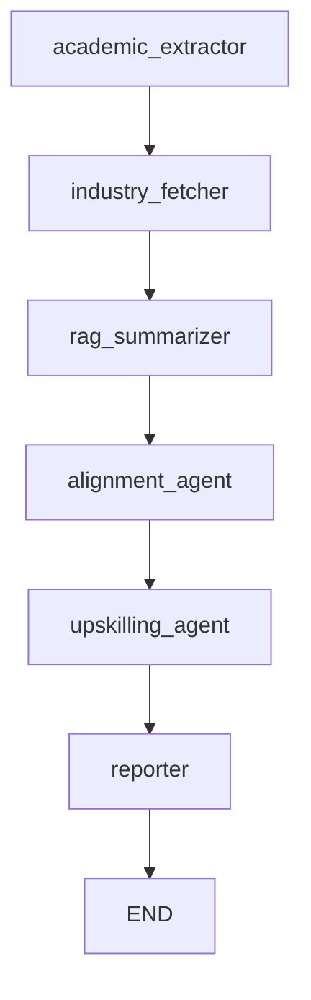

# 💼 Autonomous Agent for Industry Readiness Evaluation (LangGraph)

This project implements a robust **Autonomous AI Agent System** to evaluate a student's academic profile (from resume) against **current industry job requirements** using a **Retrieval-Augmented Generation (RAG)** pipeline. It leverages `LangGraph`, `Google Gemini`, `Tavily API`, `ChromaDB`, and `SentenceTransformers` to identify skill gaps, compute alignment scores, and suggest personalized upskilling paths.

---

## 🧠 Features

- 📄 **Resume Parsing**: Extracts education, projects, skills, and experience from PDF resumes.
- 🔍 **Industry Insight Retrieval**: Uses Tavily API to fetch real-time hiring trends and job role requirements.
- 🧠 **RAG Summarization**: Combines ChromaDB (vector DB) and Gemini (LLM) for enhanced analysis.
- 📊 **Alignment Scoring**: Calculates skill overlap between student profile and industry demands.
- 🎯 **Personalized Recommendations**: Offers tailored online courses, certifications, and project ideas.

---

## 🧠 Agent Workflow Overview

The system is structured as a **LangGraph-powered agentic workflow**, where each agent performs a distinct role in the pipeline:

| Agent Name           | Description                                                                                  |
|----------------------|----------------------------------------------------------------------------------------------|
| `academic_extractor` | Extracts academic signals (skills, education, projects, experience) from resume PDF.         |
| `industry_fetcher`   | Uses Tavily API to fetch real-time job role requirements and hiring trends.                  |
| `rag_summarizer`     | Uses RAG (ChromaDB + Gemini) to generate deep analysis of industry expectations.             |
| `alignment_agent`    | Calculates alignment score by comparing academic skills vs industry skills.                  |
| `upskilling_agent`   | Recommends personalized courses, certifications, and project ideas based on missing skills.  |
| `reporter`           | Compiles all outputs into a final evaluation report with insights and actionables.           |

Each agent is modular, stateless, and connected using `StateGraph` from LangGraph.

---

### 🔄 Agent Execution Flow Diagram



---

## ✅ Evaluation Criteria

This section outlines how the project meets all the core evaluation benchmarks for a robust AI-based solution.

| #  | Criteria                                                                                                    | Addressed | Explanation                                                                                                                                              |
|----|-------------------------------------------------------------------------------------------------------------|-----------|----------------------------------------------------------------------------------------------------------------------------------------------------------|
| 1  | Evaluates the design, functionality, and robustness of the AI agent(s)                                      | ✅ Yes    | The pipeline is modular, agentic, and built with LangGraph, ensuring clarity, robustness, and debuggability across each state transition.               |
| 2  | Assesses Retrieval-Augmented Generation (RAG), if used, for enhancing agent performance                     | ✅ Yes    | The system combines ChromaDB (vector store) and Gemini (LLM) for RAG-enabled summarization, improving relevance and grounding of generated responses.   |
| 3  | Evaluates repository organization and documentation quality (e.g., README.md)                               | ✅ Yes    | The project includes a structured file layout and a comprehensive README with setup instructions, agent descriptions, usage guide, and output samples.  |
| 4  | Measures practical value and effectiveness in addressing the problem's goal                                 | ✅ Yes    | The agent provides actionable insights like skill alignment, gap analysis, and upskilling suggestions directly from resumes—highly valuable for students.|
| 5  | Assesses appropriate use of GenAI frameworks, libraries, or tools for the solution                          | ✅ Yes    | Proper use of LangGraph, Google Generative AI (Gemini), Tavily API, ChromaDB, and Sentence-Transformers to build a production-ready, intelligent system. |

---

## 🧠 Agents in the System

This project uses a **LangGraph-powered agentic pipeline**, where each agent is a modular, stateless function that performs a specialized role. LangGraph manages the flow of execution between these agents using a `StateGraph`.

### 🤖 What is an Agent?

In this system, an **agent** is:

- ✅ **Autonomous** – Operates independently using provided input state
- ✅ **Stateless** – Doesn’t retain memory; relies on shared `state`
- ✅ **Modular** – Focused on a single task
- ✅ **Composable** – Connected via LangGraph to other agents in a pipeline

---

### 📋 Agent List & Responsibilities

| Agent Name            | Description                                                                                     | Why It’s an Agent                                                                                                  | LangGraph Role                              |
|----------------------|-------------------------------------------------------------------------------------------------|---------------------------------------------------------------------------------------------------------------------|---------------------------------------------|
| `academic_extractor` | Parses the PDF resume to extract academic signals like skills, education, experience, projects. | Performs a discrete, stateless task: extracting structured info from unstructured text (PDF).                      | First node in `StateGraph`, sets initial state. |
| `industry_fetcher`   | Queries Tavily API using multiple role-based prompts to fetch industry job requirements.         | Acts autonomously to retrieve real-world data for reasoning.                                                       | Second node, enriches state with search results. |
| `rag_summarizer`     | Uses Gemini + ChromaDB to summarize expectations based on RAG context.                          | Performs independent summarization with grounding. Takes state input, generates meaningful output.                 | Third node, adds `industry_gap_summary`.         |
| `alignment_agent`    | Compares parsed academic skills with industry-required skills and scores alignment.              | Acts as a decision evaluator agent using logic + data from past nodes.                                             | Fourth node, updates alignment score and skill diff. |
| `upskilling_agent`   | Recommends courses, certifications, and projects for the student based on missing skills.        | Generates personalized content independently, based on prior state.                                                | Fifth node, enriches state with recommendations. |
| `reporter`           | Generates final report including all extracted info, analysis, and recommendations.              | Summarizes the full agentic process into a consumable output.                                                      | Final node, just before `END`.              |

---

### 🔧 LangGraph Integration

LangGraph is used to orchestrate the execution flow between agents using a `StateGraph`.

#### 🚀 LangGraph Code Snippet

```python
from langgraph.graph import StateGraph, END

graph_builder = StateGraph(dict)

# Register agents as graph nodes
graph_builder.add_node("academic_extractor", academic_signal_extraction)
graph_builder.add_node("industry_fetcher", industry_needs_agent)
graph_builder.add_node("rag_summarizer", enhanced_rag_summarizer)
graph_builder.add_node("alignment_agent", enhanced_alignment_scoring_agent)
graph_builder.add_node("upskilling_agent", enhanced_upskilling_recommender_agent)
graph_builder.add_node("reporter", enhanced_reporter)

# Define flow
graph_builder.set_entry_point("academic_extractor")
graph_builder.add_edge("academic_extractor", "industry_fetcher")
graph_builder.add_edge("industry_fetcher", "rag_summarizer")
graph_builder.add_edge("rag_summarizer", "alignment_agent")
graph_builder.add_edge("alignment_agent", "upskilling_agent")
graph_builder.add_edge("upskilling_agent", "reporter")
graph_builder.add_edge("reporter", END)

graph = graph_builder.compile()
```

---

## ⚙️ Installation Guide

Follow these steps to set up the project on your local machine:

---

### 1️⃣ Clone the Repository

```bash
git clone https://github.com/yourusername/industry-readiness-agent.git](https://github.com/RatheeshCoder/Agentic_Al_Workshop/tree/main/Day%209/Hackathon
cd industry-readiness-agent
```

---

### 2️⃣ (Optional) Create a Virtual Environment

```bash
# For Unix/Linux/macOS
python -m venv venv
source venv/bin/activate

# For Windows
python -m venv venv
venv\Scripts\activate
```

---

### 3️⃣ Install Dependencies

```bash
pip install -r requirements.txt
```

---

### 4️⃣ Set Up Environment Variables

Create a `.env` file in the root directory and add the following keys:

```
GOOGLE_API_KEY=your_google_genai_key
TAVILY_API_KEY=your_tavily_api_key
```

> ✅ You can use the `python-dotenv` package to automatically load these keys.

---

### ✅ Run the Agent Pipeline

```bash
python app.py
```

You will be prompted to:

- 📄 Enter your resume file path (e.g., `resume.pdf`)
- 🎯 Enter your target job role (e.g., `AI Engineer`)

---

